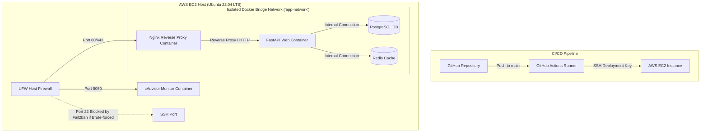

# Production FastAPI Multi-Container Stack

[](https://www.docker.com/)
[](https://fastapi.tiangolo.com/)
[](https://www.postgresql.org/)
[](https://redis.io/)
[](https://nginx.org/)
[](https://github.com/features/actions)

A production-grade, highly secure, and automated multi-container deployment architecture. This stack packages an AI-ready **FastAPI** application, a **PostgreSQL** database, a **Redis** cache, and an **NGINX** reverse proxy, fully automated using **GitHub Actions** and optimized for **AWS EC2** deployments.

**Author:** [Domeshwar Thengari](https://github.com/DomeshwarThengari)

---

## 🏗️ System Architecture

The workflow below details the path from local code commits to secure execution on AWS EC2, demonstrating network traffic isolation, reverse-proxying, and the infrastructure firewall layer:



---

## 🌟 Core Features

### 1. Near Zero-Downtime CI/CD Pipeline
* Powered by **GitHub Actions** and `appleboy/ssh-action`.
* Builds are modularly constructed so that only changed components are rebuilt.
* Re-launching containers uses direct `--no-deps` execution, minimizing target container handovers to less than 1 second.
* Automatic pruning of orphaned Docker images and volumes keeps host storage clean.

### 2. Comprehensive Health Checks & Logging
* The `/health` endpoint actively tests database connection roundtrips and Redis cache server pings rather than returning flat statuses.
* Structured application logging provides diagnostic traces for all internal connection attempts.

### 3. Resource Monitoring with cAdvisor
* Direct container monitoring is integrated using Google’s **cAdvisor** service.
* Collects real-time CPU, memory, and network utilization directly from host `/sys` filesystems, exposing metrics ready to be consumed by Prometheus and Grafana.

### 4. Secret Easter Egg Endpoint
* Custom `/antigravity` endpoint dynamically imports Python's classic `antigravity` library and issues a HTTP 307 `RedirectResponse` pointing directly to the classic [XKCD 353 Comic](https://xkcd.com/353/).

---

## 🛡️ Security & Hardening Setup

This deployment implements a defense-in-depth security approach at both the operating system and container layers:

### Host-Level Security (AWS EC2)
* **UFW Firewall**: Restricts exposed ports, ignoring random external scans.
  * **Port 22/tcp**: Restrained to custom SSH management networks.
  * **Port 80/tcp & 443/tcp**: Open for public client HTTP/HTTPS requests.
  * **Port 8080/tcp**: Restrained to internal monitoring teams.
  * **All other ports**: Implicitly denied.
* **Fail2ban Integration**: Instantly blocks client IP addresses at the kernel-level IPTables rules if SSH authentication fails more than 5 times in 10 minutes.

### Container-Level Security
* **Network Isolation**: The PostgreSQL database and Redis cache containers are entirely isolated inside a custom Docker bridge network (`app-network`). They expose zero public-facing ports to the internet and can only be queried through private Docker endpoints by the FastAPI container.
* **User Hardening**: The FastAPI application container runs as a non-privileged system user (`appuser` with UID `10001`), preventing potential container escape attempts from inheriting root host access.
* **Docker Ignore Policies**: The `.dockerignore` file filters out private `.env` assets, Nginx key files, and system git histories from ever leaking into the built container images.

---

## 🔑 SSL Strategy & Production Hardening

In standard dev environments or bare-IP deployments, Nginx can use local self-signed certificates. However, in a production setup mapped to a public domain, you must secure traffic with **trusted, end-to-end SSL/TLS encryption**. 

We support the two industry-standard production methods: **Let's Encrypt (Certbot)** for direct public deployments, and **Cloudflare Full (Strict) SSL** for proxy/CDN deployments.

---

### Method A: Let's Encrypt (Certbot) — Direct Public HTTPS

#### Why it is used:
* **Globally Trusted Certificate Authority**: Let's Encrypt provides free SSL certificates recognized by all major browsers.
* **Direct Access**: Best for stacks queried directly by clients without an intermediate proxy or CDN.
* **Auto-Renewal**: Automated using **Certbot** via standard ACME challenges (HTTP-01).

```
Client Browser <================== (HTTPS: TLS 1.3) ==================> Nginx (EC2 Host)
```

#### Step-by-Step Integration & Commands:

##### 1. Temporarily spin down the Nginx container if it is binding to port 80:
```bash
docker compose stop nginx
```

##### 2. Install Certbot on the EC2 Host:
```bash
sudo apt-get update
sudo apt-get install -y certbot python3-certbot-nginx
```

##### 3. Request the Certificate:
*(Certbot will bind to port 80 temporarily to verify domain ownership via HTTP-01 challenge)*
```bash
sudo certbot certonly --standalone -d example.com -d www.example.com
```

##### 4. Mount Certificates in `docker-compose.yml`:
Configure your Nginx service block to mount the host's Let's Encrypt directory:
```yaml
  nginx:
    image: nginx:alpine
    ports:
      - "80:80"
      - "443:443"
    volumes:
      - ./nginx/nginx.conf:/etc/nginx/nginx.conf:ro
      - /etc/letsencrypt:/etc/letsencrypt:ro  # <-- Mount Let's Encrypt directory
```

##### 5. Configure `nginx/nginx.conf` for Let's Encrypt Certificates:
```nginx
server {
    listen 80;
    server_name example.com www.example.com;
    return 301 https://$host$request_uri; # Redirect HTTP to HTTPS
}

server {
    listen 443 ssl;
    server_name example.com www.example.com;

    # Let's Encrypt Certificate paths inside Nginx container
    ssl_certificate     /etc/letsencrypt/live/example.com/fullchain.pem;
    ssl_certificate_key /etc/letsencrypt/live/example.com/privkey.pem;

    ssl_protocols             TLSv1.2 TLSv1.3;
    ssl_prefer_server_ciphers on;
    ssl_ciphers               'ECDHE-ECDSA-AES128-GCM-SHA256:ECDHE-RSA-AES128-GCM-SHA256:ECDHE-ECDSA-AES256-GCM-SHA384:ECDHE-RSA-AES256-GCM-SHA384';

    location / {
        proxy_pass http://web:8000;
        # ... standard proxy headers ...
    }
}
```

##### 6. Restart Nginx & Automate Renewals:
Start your containers:
```bash
docker compose up -d nginx
```
Verify the auto-renewal cronjob is active (Let's Encrypt certificates expire every 90 days):
```bash
sudo systemctl status certbot.timer
```

---

### Method B: Cloudflare Full (Strict) SSL — Proxy/CDN Deployment

#### Why it is used:
* **DDoS & Web Protection**: Protects your origin server IP using Cloudflare’s Global Edge proxy network and Web Application Firewall (WAF).
* **End-to-End Encryption**: Prevents "Man-in-the-Middle" interception between Cloudflare edge routers and your EC2 origin host.
* **15-Year Validity**: Cloudflare Origin Certificates last for 15 years, eliminating quarterly certificate renewal hassles.

```
Client Browser <== (HTTPS: Edge Certificate) ==> Cloudflare Edge <== (HTTPS: Origin Certificate) ==> Nginx (EC2 Host)
```

#### Step-by-Step Integration & Commands:

##### 1. Generate the Cloudflare Origin Certificate:
1. Log in to your **Cloudflare Dashboard**.
2. Navigate to **SSL/TLS > Origin Server** and click **Create Certificate**.
3. Keep default settings, ensure your domain patterns (`example.com`, `*.example.com`) are listed, and click **Create**.
4. Copy the **Origin Certificate** and the **Private Key** text blocks.

##### 2. Save the Certificates on your Host:
Navigate to your project root directory on the EC2 host and run:
```bash
# Create the secure certs directory
mkdir -p nginx/certs

# Create and paste your Cloudflare Origin Certificate block here
nano nginx/certs/cloudflare.crt

# Create and paste your Cloudflare Private Key block here
nano nginx/certs/cloudflare.key

# Lock down the private key read permissions for security
chmod 600 nginx/certs/cloudflare.key
```

##### 3. Mount Certificates in `docker-compose.yml`:
Configure your Nginx service block to mount your local keys directory:
```yaml
  nginx:
    image: nginx:alpine
    ports:
      - "80:80"
      - "443:443"
    volumes:
      - ./nginx/nginx.conf:/etc/nginx/nginx.conf:ro
      - ./nginx/certs:/etc/nginx/certs:ro  # <-- Mount local certs folder
```

##### 4. Configure `nginx/nginx.conf` for Cloudflare SSL Termination:
```nginx
server {
    listen 80;
    server_name example.com www.example.com;
    return 301 https://$host$request_uri;
}

server {
    listen 443 ssl;
    server_name example.com www.example.com;

    # Cloudflare Origin Certificates Mount Locations
    ssl_certificate     /etc/nginx/certs/cloudflare.crt;
    ssl_certificate_key /etc/nginx/certs/cloudflare.key;

    ssl_protocols             TLSv1.2 TLSv1.3;
    ssl_prefer_server_ciphers on;
    ssl_ciphers               'ECDHE-ECDSA-AES128-GCM-SHA256:ECDHE-RSA-AES128-GCM-SHA256:ECDHE-ECDSA-AES256-GCM-SHA384:ECDHE-RSA-AES256-GCM-SHA384';

    location / {
        proxy_pass http://web:8000;
        # ... standard proxy headers ...
    }
}
```

##### 5. Enable "Full (Strict)" Encryption in Cloudflare:
Navigate to the **Cloudflare Dashboard > SSL/TLS > Overview** and change your encryption setting to **Full (strict)**.

##### 6. Lock down Host Firewall (UFW) to Cloudflare IPs Only:
Run this script to block any incoming traffic to ports 80 and 443 that does not originate directly from Cloudflare's official IP nodes:
```bash
# Clear any wide-open HTTP/HTTPS firewall rules
sudo ufw delete allow 80/tcp
sudo ufw delete allow 443/tcp

# Allow only Cloudflare IPv4 nodes
for ip in $(curl -s https://www.cloudflare.com/ips-v4); do
    sudo ufw allow from "$ip" to any port 80 proto tcp
    sudo ufw allow from "$ip" to any port 443 proto tcp
done

# Allow only Cloudflare IPv6 nodes
for ip in $(curl -s https://www.cloudflare.com/ips-v6); do
    sudo ufw allow from "$ip" to any port 80 proto tcp
    sudo ufw allow from "$ip" to any port 443 proto tcp
done

# Reload the host firewall
sudo ufw reload
```

---

## 🚀 Local Setup & Deployment

Follow these instructions to run the entire multi-container stack locally for development or validation:

### 1. Prerequisites & Docker Installation

Before running the application, you must install **Docker** and the **Docker Compose** plugin.

#### For Linux / Ubuntu Server:
Execute the following commands in your terminal to set up the official Docker repository, install the runtime engine, and enable passwordless docker usage:

```bash
# 1. Update system packages
sudo apt-get update -y

# 2. Install certificates and curl
sudo apt-get install -y ca-certificates curl gnupg

# 3. Add Docker's official GPG key
sudo install -m 0755 -d /etc/apt/keyrings
curl -fsSL https://download.docker.com/linux/ubuntu/gpg | sudo gpg --dearmor -o /etc/apt/keyrings/docker.gpg
sudo chmod a+r /etc/apt/keyrings/docker.gpg

# 4. Set up the stable repository list
echo \
  "deb [arch=$(dpkg --print-architecture) signed-by=/etc/apt/keyrings/docker.gpg] https://download.docker.com/linux/ubuntu \
  $(. /etc/os-release && echo "$VERSION_CODENAME") stable" | \
  sudo tee /etc/apt/sources.list.d/docker.list > /dev/null

# 5. Install Docker Engine and the Docker Compose plugin
sudo apt-get update -y
sudo apt-get install -y docker-ce docker-ce-cli containerd.io docker-buildx-plugin docker-compose-plugin

# 6. Configure user permissions (run docker commands without 'sudo')
sudo usermod -aG docker $USER
# Apply group updates instantly in the current terminal session
exec sg docker "$SHELL"
```

#### For macOS & Windows:
Simply download and install the official [Docker Desktop](https://www.docker.com/products/docker-desktop/) package, which automatically bundles both the Docker Engine and the Docker Compose command line utility.

### 2. Clone the Repository
```bash
git clone https://github.com/DomeshwarThengari/FastAPI-Production-Deployment-Docker.git
cd FastAPI-Production-Deployment-Docker
```

### 3. Set Up Environment Variables
Create a local `.env` file using the configuration template:
```bash
cp .env.example .env
```

Review the values inside `.env` and adapt the database user and password credentials to secure custom values:
```ini
POSTGRES_USER=postgres
POSTGRES_PASSWORD=your_super_secure_password_here
POSTGRES_DB=production_db
POSTGRES_HOST=db
POSTGRES_PORT=5432

DATABASE_URL=postgresql://postgres:your_super_secure_password_here@db:5432/production_db
REDIS_URL=redis://redis:6379/0
```

### 4. Build and Spin Up the Stack
```bash
docker compose up --build -d
```

Once execution completes:
* **FastAPI Backend (via Proxy)**: [http://localhost/](http://localhost/)
* **Health API Check**: [http://localhost/health](http://localhost/health)
* **cAdvisor Dashboard**: [http://localhost:8080/](http://localhost:8080/)

---

### 5. Production Host Hardening (UFW Firewall & Fail2ban)

To protect your AWS EC2 production instance from malicious sweeps and brute-force intrusion:

#### A. Configure the UFW (Uncomplicated Firewall)
UFW sits at the OS level on Ubuntu. Lock down all incoming traffic except for the exact ports required:
```bash
# 1. Reset UFW rules to secure defaults (Deny all incoming, allow all outgoing)
sudo ufw default deny incoming
sudo ufw default allow outgoing

# 2. Allow SSH (Port 22) to prevent locking yourself out of the instance
sudo ufw allow 22/tcp

# 3. Allow standard web traffic (Port 80 for HTTP, Port 443 for HTTPS)
sudo ufw allow 80/tcp
sudo ufw allow 443/tcp

# 4. Allow cAdvisor traffic for internal monitoring teams (Port 8080)
sudo ufw allow 8080/tcp

# 5. Enable the firewall
sudo ufw enable
```
Check firewall status and allowed ports:
```bash
sudo ufw status verbose
```

#### B. Configure Fail2ban to Block Brute-force SSH Attacks
Fail2ban dynamically monitors `/var/log/auth.log` and bans IPs demonstrating suspicious brute-force activity.

1. **Install Fail2ban**:
   ```bash
   sudo apt-get install -y fail2ban
   ```
2. **Create the Local Jail Configuration**:
   *(Always edit jail.local, never edit the default jail.conf)*
   ```bash
   sudo nano /etc/fail2ban/jail.local
   ```
   Paste the following optimized SSH brute-force jail rule block:
   ```ini
   [DEFAULT]
   bantime = 1h        # Ban malicious IPs for 1 hour
   findtime = 10m      # Search window of 10 minutes
   maxretry = 5        # Allow maximum 5 failed attempts before ban

   [sshd]
   enabled = true
   port = ssh
   filter = sshd
   logpath = /var/log/auth.log
   backend = systemd
   ```
3. **Enable and Start the Service**:
   ```bash
   sudo systemctl enable fail2ban
   sudo systemctl restart fail2ban
   ```
4. **Monitor Ban Status**:
   To inspect the active SSH ban database and lists:
   ```bash
   sudo fail2ban-client status sshd
   ```

---

### 6. Automated PostgreSQL Backups Configuration

The system includes a dedicated `db_backup.sh` script to automate daily logical database dumps from your PostgreSQL container.

#### Step-by-Step Setup:

##### 1. Create the Backup Script locally on your host:
Save your backup script (for example, to `/home/ubuntu/db_backup.sh`). Make sure to replace `/path/to/your/project` inside the script with the absolute path of your project root folder:
```bash
nano /home/ubuntu/db_backup.sh
```

##### 2. Verify script configuration:
Ensure the file contains the container backup commands (which executes `pg_dump` inside the running postgres container and prunes dumps older than 7 days):
```bash
#!/bin/bash
# Backup script for PostgreSQL running in Docker
BACKUP_DIR="/home/ubuntu/backups"
DATE=$(date +%Y-%m-%d_%H-%M-%S)
mkdir -p $BACKUP_DIR

# Using docker compose to execute pg_dump inside the db container
# NOTE: Update the project path to match your deployment directory!
docker compose -f /home/ubuntu/Fast-API-deployment/docker-compose.yml exec -t db pg_dump -U postgres production_db > $BACKUP_DIR/db_backup_$DATE.sql

# Keep only last 7 days of backups to prevent disk depletion
find $BACKUP_DIR -type f -name "*.sql" -mtime +7 -delete
```

##### 3. Make the Backup Script Executable:
```bash
chmod +x /home/ubuntu/db_backup.sh
```

##### 4. Test the script manually to ensure it successfully creates a backup SQL file:
```bash
bash /home/ubuntu/db_backup.sh
ls -la /home/ubuntu/backups
```

##### 5. Configure Cron Scheduling for Automated Daily Backups:
Open your user's crontab configuration editor:
```bash
crontab -e
```
Add the following line to schedule the backup to run automatically every night at **2:00 AM**:
```text
0 2 * * * /bin/bash /home/ubuntu/db_backup.sh >> /home/ubuntu/backups/backup_cron.log 2>&1
```

---

## 🔮 Future Scope & Infrastructure Evolution

As the application payload and request rates scale, this architecture is designed to transition to high-availability cluster orchestration:

```
[Local Development]          [Continuous Deployment]         [Target Orchestration]
  Vite / Python      ====>       GitHub Actions      ====>     Kubernetes Cluster
  (Docker Compose)                  & Flux CD                  (EKS / MicroK8s)
```

1. **Kubernetes Orchestration**: Migrating the stack from basic Docker Compose services into a declarative **Kubernetes** cluster setup (testing with Minikube/Kind locally, deploying to **AWS EKS** in production).
2. **GitOps-Driven Deployment**: Implementing **Flux CD** or Argo CD to track repository states, eliminating manual terminal deployments and establishing a self-healing infrastructure state.
3. **Horizontal Pod Autoscaling**: Dynamically scaling FastAPI application pods in response to CPU/Memory thresholds using K8s Horizontal Pod Autoscalers (HPA).
